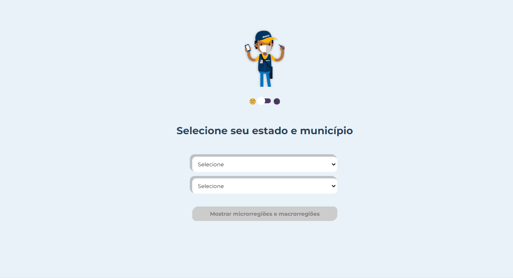
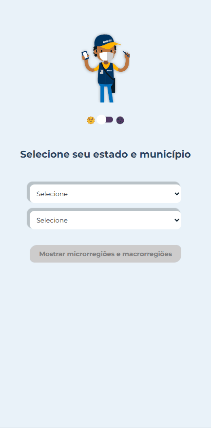

# IBGE Infos

Esse projeto é um teste técnico para a IPAM - Instituto de Pesquisa Ambiental da Amazônia, no qual o propósito era consumir a API de localidades do IBGE

## Link de Acesso

📍<a href="https://ibg-eapi.vercel.app/">IBGE Infos</a>

## Tecnologias Utilizadas

- IBGE API - https://servicodados.ibge.gov.br/api/docs/localidades
- ReactJS
- JavaScript
- StyledComponents
- Redux
- CSS
- PropTypes
- React Router DOM

## Requisitos Técnicos

- Criar um select para selecionar um estado.
- Criar um select para selecionar um município.
- Ao selecionar um município mostrar as informações de microrregião, mesorregião, UF e região do município.

## Requisito Obrigatório

- Usar os três conceitos centrais do redux: store, reducers e actions
## Layout

- Desktop


- Mobile



## Como rodar o projeto


```
$ git clone https://github.com/zkauansantos/IBGEapi.git
```

```
$ cd IBGEapi
```

```
$ yarn or npm install
```
```
$ yarn start or npm start
```

## Desafios

Bom aqui pude usar o redux em um projeto pela primeira vez, por mais que eu já conhecia nunca tinha usado em um projeto, e ainda pude me atualizar pois conhecia a versão anterior e aqui pude usar o redux/toolkit conhecendo o slice, esse foi o maior desafio do projeto que foi gerenciar esse estado.

## Observações finais

Nesse projeto não quis utilizar a tag form na parte dos selects pois já estou fazendo outro projeto nessa forma trabalhando com um CRUD, inclusive se quiserem dar uma olhada é o repositório frontEndMyContacts. Mas fica aqui a observação, preferi trabalhar pegando o valor do estado global da store do Redux e so fazer a outra page consumir após clicar no botão por trás dos panos, Agradeço a oportunidade do teste.
